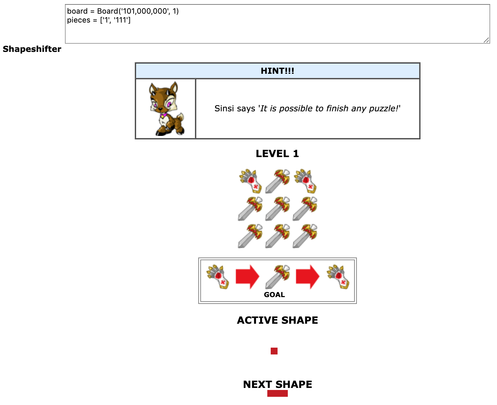
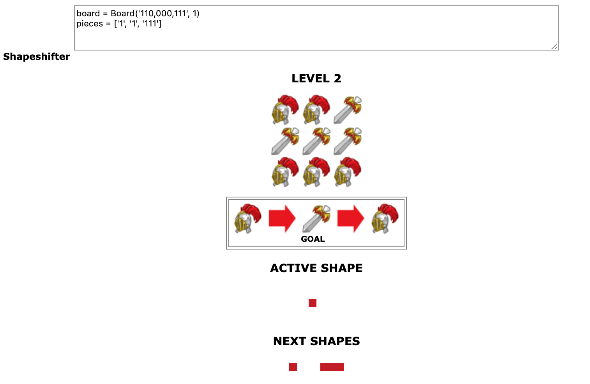
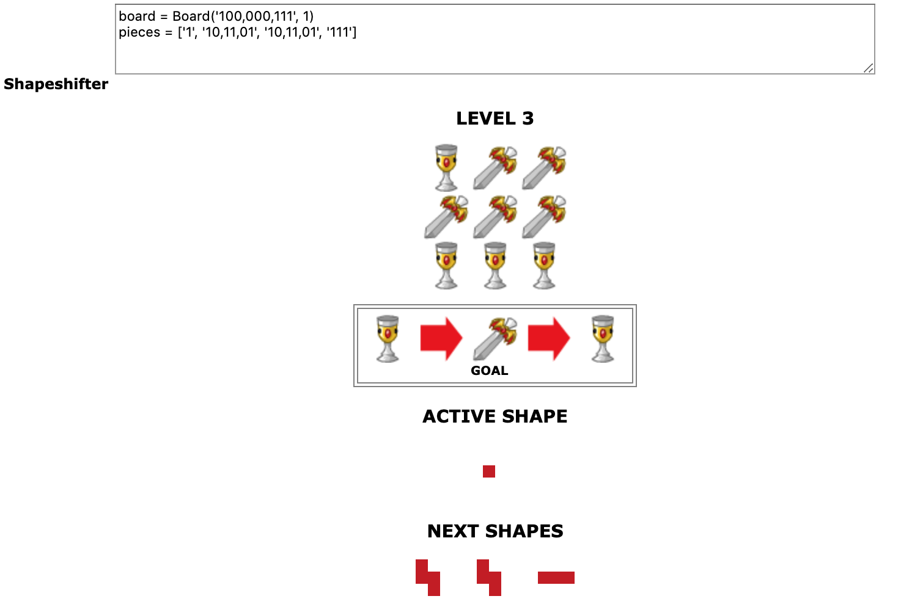

# Neopets Shapeshifter Solver
I wrote this a long time ago, mostly as a challenge to myself. Until quantum computers are commercially available and found in the common household, the best way to go about this puzzle is to brute force it.

Be sure to read the notes at the bottom of this readme if you actually plan to use this.

## Requirements
* Python 3
  * I tossed in my Numpy implementation but it turned out being around 4 times _slower_, so installing Numpy is omitted, but the code is there to improve upon. Numpy is not intended to be looped with, and this is recursive. Maybe it just needs redoing.
* Greasemonkey/Tampermonkey browser extension (for Firefox, Chrome respectively)

## Installing
* Add `./userscript.js` to the -Monkey you installed, this will spit out the code for the script.
  * I went with this method instead of copying-and-pasting (or even saving) the page's source code because it's a few clicks less, and is 100% less cleanup by the user.

## Usage
_Though this is for educational purposes, it has been stated by Neo-staff [citation needed (but it's there I swear)] that it's not cheating if you're the one inputting the answers._ So no automation!

Once you add the userscript to your browser, going to a [Shapeshifter](http://www.neopets.com/medieval/shapeshifter_index.phtml) puzzle will add a textarea with the code you'll put into `./main.py`. You can't miss where it goes, trust me.


## Examples


_Oh yes it is, Sinsi._ 😉

Python Output:
```
Move 1: Place piece at column 1, row 0
Move 2: Place piece at column 0, row 0
```

---



Python Output:
```
Move 1: Place piece at column 0, row 0
Move 2: Place piece at column 1, row 0
Move 3: Place piece at column 0, row 2
```

---



Python Output:
```
Move 1: Place piece at column 0, row 0
Move 2: Place piece at column 0, row 0
Move 3: Place piece at column 0, row 0
Move 4: Place piece at column 0, row 2
```

---

_You get the idea._

## Notes
* A C-implementation would be much faster, obviously.
  * Heck, even [cythonizing](https://cython.readthedocs.io/en/latest/src/tutorial/cython_tutorial.html) this script doubles the speed.
  * Making a CUDA version would be amazingly faster, being run on a GPU instead of CPU. Why mine altcoins when you can win at Neopets?
* Besides Level 1, every puzzle is randomly generated.
* As levels go higher:
  * the boards get bigger
  * pieces get bigger
    * and more numerous
  * the delta increases (so instead of toggling between 2 such as the gauntlet and the sword, it'll go through 3, 4, ...5? things! This DRASTICALLY increases execution time.)
* I wouldn't suggest letting this run more than a few hours, it's just not worth it. Turn it off, lose the level on purpose, and start over. If you're lucky, the new one will finish quickly.
* Don't finish puzzles on Neo too quickly. Looks bad for you.